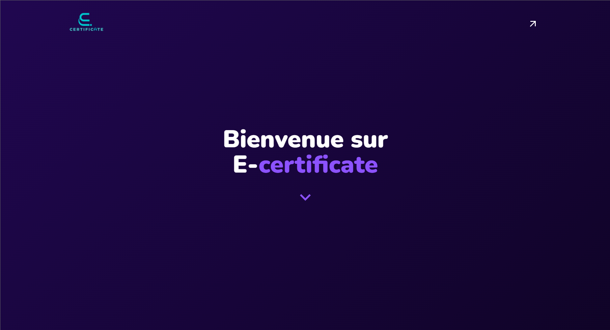
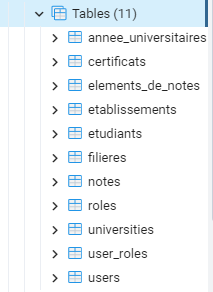

<a name="readme-top"></a>
<div align="center">

[![Contributors][contributors-shield]][contributors-url]
[![Stargazers][stars-shield]][stars-url]
[![Issues][issues-shield]][issues-url]
[![MIT License][license-shield]][license-url]

</div>

<!-- PROJECT LOGO -->
<br />
<div align="center">
<p
align="center"><a href="https://github.com/abderox/e-certificate-signature-algorand">
    
  </a><a href="https://github.com/abderox/e-certificate-signature-algorand">
    
  </a></p>

  
  <h1 align="center">E-CERTIFICATE</h1>

  <p align="center">
    This project is a proof of concept for a digital certificate system using Algorand blockchain.
    <br />
    <a href="https://e-certificate.vr4.ma/"><strong>Explore the website »</strong></a>
    <br />
    <br />
    <a href="https://github.com/abderox/e-certificate-signature-algorand/issues">Report Bug</a>
    ·
    <a href="https://github.com/abderox/e-certificate-signature-algorand/issues">Request Feature</a>
  </p>
</div>

<!-- TABLE OF CONTENTS -->
<details>
  <summary>Table of Contents</summary>
  <ol>
    <li>
      <a href="#about-the-project">About The Project</a>
      <ul>
        <li><a href="#built-with">Built With</a></li>
      </ul>
    </li>
    <li>
      <a href="#getting-started">Getting Started</a>
      <ul>
        <li><a href="#prerequisites">Prerequisites</a></li>
        <li><a href="#installation">Installation</a></li>
      </ul>
    </li>
    <li><a href="#usage">Usage</a></li>
    <li><a href="#structure">Project Structure</a></li>
    <li><a href="#contributing">Contributing</a></li>
    <li><a href="#license">License</a></li>
    <li><a href="#contact">Contact</a></li>
    <li><a href="#acknowledguts">Acknowledgments</a></li>
    <li><a href="#cpanel-&-heroku-configuration">Cpanel & Heroku configuration</a></li>
  </ol>
</details>

<!-- ABOUT THE PROJECT -->
## About The Project

[![Product Name Screen Shot][product-screenshot]](https://e-certificate.vr4.ma/)
[![Product Name Screen Shot 2][product-screenshot-2]](https://e-certificate.vr4.ma/login)

Our project is a proof of concept for a digital certificate system using Algorand blockchain. The main goal of this project is to provide a secure and reliable way to issue and verify digital certificates. The project is composed of two parts: the website and the blockchain. The website is used to issue and verify certificates. The blockchain is used to store the certificates and to verify the authenticity of the certificates.And this solution is unique because of several reasons:
<br>

Here's why:

* We are trying to think outside the box by innovating a brand new E-Certificate solution, which will replace both automatic signature and traditional signature to introduce blockchain and web 3.0 in this product.

* We are trying to solve the problem of certificate forgery by using blockchain technology.

* In terms of performance and ease, adopting this solution will help university staff reduce the time spent signing and reviewing diplomas generated for thousands of students each year.

<br>
We are thriving to see the next generation of our major, IRISI for computer science and networking  to finish this piece of art with more
features and a better user experience. And why not witnessing some day our University  being the first to use this technology in the Kingdom of Morocco.

<p align="right">(<a href="#readme-top">back to top</a>)</p>

### Built With

Here are the main technologies used in this project:

* [![React][React.js]][React-url]
* [![Material-ui][Material-ui]][Material-ui-url]
* [![redux][redux]][redux-url]

<br>

* [![Node.js][Node.js]][Node.js-url]
* [![Express][Express]][Express-url]
* [![MySQL][MySQL]][MySQL-url]

<br>

* [![Algorand][Algorand]][Algorand-url]

<br>

* [![npm][npm]][npm-url]
* [![yarn][yarn]][yarn-url]

<p align="right">(<a href="#readme-top">back to top</a>)</p>

<!-- GETTING STARTED -->
## Getting Started

In this section, we will explain how to setup the project locally.

### Prerequisites

You should have installed nodejs and npm on your machine. You can download them from [here](https://nodejs.org/en/download/), and
the versions used in this project are > 14.0 and > 8.0 respectively.
or yarn

* node

  ```sh
  node -v
  ```

* npm

  ```sh
  npm -v
  ```

* yarn

  ```sh
  yarn -v
  ```

The next thing to make sure you have is mysql or postgres installed in your machine . postgres v14 or mysql > 5

### Installation

_Below you will be instructed how to setup the project locally.Our project is divided into three parts_

* **Frontend**
* **Backend**
* **Local-server**

<br>

1. Create a folder locally named e-certificate-fstg
2. Clone the repo for frontend

   ```sh
   git clone https://github.com/abderox/e-certificate-signature-algorand
   ```

3. Install NPM packages (If you are facing issues with npm , use yarn)

   ```sh
   npm install
   ```

   or

    ```sh
    yarn install
    ```

4. Go to `utils/global-constants.js` and uncomment this line to work locally .

   ```js
   //const BASE_URL_API = "http://127.0.0.1:7000/api";
   const BASE_URL_API = "https://thawing-lake-25095.herokuapp.com/api";
   ```

5. Now clone the backend repository

    ```sh
    git clone https://github.com/kaoutar-ou/e-certificate-signature-algorand-backend
    ```

    ```diff
    - Note : the branch named mysql contains the backend project , the branch renowned local-server , contains the code for retrieving the mac address from your laptop (We will explain that later)
    ```

6. Install NPM packages (ensure you are in the mysql branch)

    ```sh
    npm install
    ```

    or

      ```sh
      yarn install
      ```

7. Go to `config/db.js` and change the database credentials to your local database credentials.
8. copy `.env.example` to `.env` and change the database credentials to your local database credentials.
9. Go to `app.js` and change ```force:false``` to ```force:true``` 
    
    ```js
   sequelize.authenticate().then(() => {
        console.log('Connected to database');
        sequelize.sync({ force: true }).then(() => {
        console.log('Database synchronized');
        initial();
        }
        );
        }).catch((error) => {
        console.error('Unable to connect to the database', error);
        });
    ```
    ```diff
    ! Note : this step is important because it will create the tables in your database . Do it once and make sure the tables have been created in your database . After that change force:true to force:false.  
    - In order to avoid dropping the tables each time you run the project
    ```

10. Now switch to local-server (We prefer to open in a separate project , it should be running all the time )

```diff
+ Note : We prefer to use PM2 , so it could be running even after booting your laptop.
 
  
```

* If you are good with node command go ahead

```sh
    node index.js
```

* PM2 is a process manager for Node.js applications with a built-in load balancer. It allows you to keep applications alive forever, to reload them without downtime and to facilitate common system admin tasks.

* Check this :

    <https://pm2.keymetrics.io/>

    and this

    <https://www.tecmint.com/enable-pm2-to-auto-start-node-js-app/>

### Example Usage

<br>

* Install PM2

    ```sh
    npm install pm2 -g
    ```

* Start the local-server

    ```sh
    pm2 start index.js
    ```

* Check the logs

    ```sh
    pm2 logs
    ```

* Stop the local-server

    ```sh
    pm2 stop index.js
    ```

```
```
  
11. Database configuration

_If you are using MySQL_

* Run mysql server in your XAMPP or WOMP server
* Go to phpmyadmin
* Create a database named what you have have called it in the  `.env` file .

_If you are using Postgres_

* Go to pgadmin
* Create a database named what you have have called it in the  `.env` file .

12. Email configuration

  In order to send emails, you need to configure your email in the `.env` file.
    
```sh
    SMTP_HOST= # your email host (smtp.gmail.com for gmail)
    SMTP_PORT= # your email port (587 for gmail)
    SMTP_USER= # your email
    SMTP_PASSWORD= # your email password
    SMTP_FROM= # your email sender
```

13. Algorand configuration
  
  We are using Algorand blockchain to sign the certificates, verify their authenticity and to store the certificates details in the blockchain.
  In order to use Algorand on the project, you need to follow the steps below:

* Install the AlgoSigner extension in your browser.
* Choose the network you want to work with (TestNet for testing , MainNet for production).
* Create a wallet in AlgoSigner, copy the mnemonic and paste it in the `.env` file.
* Copy the address and paste it in the `.env` file.
* Go to https://developer.purestake.io/ and create an account, then create an API key and paste it in the `.env` file.
* Copy the Purestake Algod and Indexer API URLs and paste them in the `.env` file.

```sh
    ADDR_CREATOR_TESTNET= # your account address
    MNEMONIC_CREATOR_TESTNET= # your mnemonic
    ALGOD_TOKEN_TESTNET= # your API key
    INDEXER_TOKEN_TESTNET= # your API key
    ALGOD_ADDR_TESTNET= # your Algod API address
    INDEXER_ADDR_TESTNET= # your Indexer API address
```

14. Now you can run the project locally by running the following commands in three different terminals:

_Run node backend server_

```sh
    npm run start
```

_Run react frontend server_

```sh
    npm start
```

_Run local-server_

```sh
    pm2 start index.js or  node index.js
```

<p align="right">(<a href="#readme-top">back to top</a>)</p>

## Usage

If everything is working fine , you should be able to see the following page :

[HOME PAGE](https://e-certificate.vr4.ma/)

<p
  align="center"
>

</p>

The first  time running the project , make sure your tables are created successfully.

```diff
! Note : This may not be the last version of our database , it is just to make things evident as clear as day. the screenshot below was taken from pgAdmin.
```

<p
  align="center"
>

</p>


<p align="right">(<a href="#readme-top">back to top</a>)</p>

<!-- Project backend -->
# Structure

 **<h2>Backend</h2>**
<p
  align="left"
>


* **app.js** : The main file of the project , it contains the main logic of the project , it is the entry point of the project.
* **config** : Contains the database configuration file

* **.env** : contains environment variables for from database configuration to blockchain configuration .

[](https://hamzamohdzubair.github.io/redant/)

* **controllers** : Contains the controllers of the project , each controller is responsible for a specific common tasks. for example
  * **auth.controller.js** : Contains the logic of the authentication process , it is responsible for the login and register process.
  * **process.controller.js** : Contains the logic of the certificate process , it is responsible for the creation and verification process.
  * **blockchain.controller.js** : Contains the logic of the blockchain process , it is responsible for the blockchain creation and verification process.

* **middlewares** : Contains the middlewares of the project , each middleware is responsible for a specific task . For instance
  * **auth.js** : Contains the logic of the authentication process , it is responsible for the login and register process.
  * **upload.js** : contains the logic of excel files uploading .

* **models** : Contains the models of the project , each model is responsible for a specific task . Fo example
  * **User.js** : Contains the logic of the user model .
  * **Etudiant.js** : Contains the logic of the Etudiant model .
  * **University.js** : Contains the logic of the University model .

* **routes** : Contains the routes of the project , each route is responsible for a specific task . For example .
  * **algo.js** : Contains the logic of the blockchain process .
  * **process.js** : Contains the logic of the certificate process , it is responsible for the creation and verification process.

* **utils** : Contains the utils of the project , each util is responsible for a specific task . For example
  * **user.js** : Contains commonly used methods , like password or email generation .

[](https://hamzamohdzubair.github.io/redant/)

* **index.js** : Contains the logic of the certificate process pure methods , like QR generation , certificate generation .
* [](https://crates.io/crates/redant)
  * **canvas** : Contains the templates for certificates (currently we are using the ```certif_7.png``` and ```certif_8.png```)
* [](https://crates.io/crates/redant)
  * **index.hbs** : is the default html template engine we have created to inject data (student information) dynamically into the certificate.
    * **hbs** : stands for handlebars


[](https://hamzamohdzubair.github.io/redant/)
* **index.js** : Nothing biggy , Only to make sure the user roles are created before registering new users.
  
[](https://hamzamohdzubair.github.io/redant/)
* **stateless_sc.teal** : Contains the logic of the smart contract , it is responsible for the verification process, it only allows the specified address to sign the certificate.

**<h2>Frontend</h2>**
<p
  align="left"
>


* [](https://crates.io/crates/redant)
  * **src** : Contains the source code of the project , it is the entry point of the project.
    * [](https://crates.io/crates/redant)
        - Nothing doggy , it Contains the logic of communication with the server using REST API , thanks to axios lirary. 
     * [](https://crates.io/crates/redant)
        - Contains the logic of the hooks , each hook is responsible for a specific task . For example
           *For this project luckily , there is only one simple hook , No need to disturb yourself with this folder 😉
      * [](https://crates.io/crates/redant)
        - Contains the logic of the layout , each layout is responsible for a specific task . like sidebar , profile section , wallet section ...
       * [](https://crates.io/crates/redant)
          - Just to make things clear and neat . Using the same menu component , we can specify for each actor (user with roles) , the authorized features and functionalities he is able to see and use . For example 🔽
  

      <br>

      _the super admin can create both admins and students so ⬇️_
          

      <br>

      _the admin can only create students ⬇️_
          

      
      * [](https://crates.io/crates/redant)
          - In this folder we have specified for each actor , the authorized paths he could access , depending on his roles.
          - This is easy to manipulate and modify , You need just to understand a bit the architecture we been following.
      * [](https://crates.io/crates/redant)
          - In this project we have been manipulating the concept of centralized store for state management and we have chosen **_Redux_**
          - The ```actions.js``` file contains all the constants for the actions .
          - The files which end with ```***Action.js``` contains the logic of the action.js.
          - The files which end with ```***Reducer.js``` contains the logic of the reducer.
          - ```reducer.js``` combine all the reducers of the application
          - ```index.js``` for store creation .
      * [](https://crates.io/crates/redant)
        - contains the reusable components like loaders , accordions , cards ...
      * [](https://crates.io/crates/redant) 
          - Contains boiler-plate functions and global constants ...
       * [](https://crates.io/crates/redant) 
          - Contains the views (pages ) it is what the end user see, (combines all of the components , actions , assets .. etc)     

<br>

* **package.json** : contains the dependencies of the project.


<p align="right">(<a href="#readme-top">back to top</a>)</p>


## Cpanel & Heroku configuration
In this section, we will explain how to deploy the project on cpanel.

### Database configuration
* First go to your cpanel and click on the `Databases` tab
* Click on `MySQL Databases`
* On the `Create New Database` section, enter the name of your database and click on the `Create Database` button
* Go to the `Create New User` section, enter the name of your user and click on the `Create User` button
* Go to the `Add User to Database` section, select the database and user you created and click on the `Add` button
* Go to the `Change Password` section, enter the password you want to use and click on the `Change Password` button

To use the database, you need to update your `.env` with the following lines :
```sh
    HOST= # your_host
    USER= # your_user
    PASSWORD= # your_password
    DB_NAME= # your_database_name
    DIALECT= # mysql
```

Alternatively, if you already deployed the project on cpanel, heroku or any other hosting service, you can add the database configuration to your project by setting environment variables.

You can add remote access to your database by following these steps :
* Go to the `Databases` tab
* Click on `Remote MySQL`
* Enter the IP address of the machine you want to access the database from and click on the `Add Host` button

<a name="domain-conf"></a>

### Domain configuration
* Go to the `Domains` tab
* Click on `Domains`
* Click on the `Create a new Domain` button
* Enter the domain name you want to use and click on the `Submit` button


### Frontend configuration
* Complete steps in <a href="#domain-conf">domain configuration</a> before proceeding
* Go to the `Files` tab
* Click on `File Manager`
* Click on the `public_html` folder
* Create a new folder with the name of your project
* Click on the `Upload` button
* Upload the `build` folder of the frontend project
* Add the following lines to the `.htaccess` file, if it doesn't exist create it
```sh
    <IfModule mod_rewrite.c>
      Header set Access-Control-Allow-Origin '*'
      RewriteEngine On
      RewriteBase /
      RewriteRule ^index\.html$ - [L]
      RewriteCond %{REQUEST_FILENAME} !-f
      RewriteCond %{REQUEST_FILENAME} !-d
      RewriteCond %{REQUEST_FILENAME} !-l
      RewriteRule . /index.html [L]
    </IfModule>
```


### Backend configuration 

If you chose to deploy the backend on **`cpanel`**, you need to follow these steps :
* Complete steps in <a href="#domain-conf">domain configuration</a> before proceeding
* Go to the `Files` tab
* Click on `File Manager`
* Click on the `public_html` folder
* Create a new folder with the name of your project
* Click on the `Upload` button
* Zip your backend project except the `node_modules` folder
* Upload the `.zip` folder of the backend project
* Unzip the `.zip` folder
* Create `.htaccess` file if it doesn't exist
* Go to the `Software` tab
* Click on `Setup Node.js App`
* Click on the `Create Application` button
* Fill in the form, choose the `Node.js` version you want, select the application mode (development or production), add your environment variables and click on the `Create` button
* You will be redirected to the `Node.js Web Applications` page, click on the `Start` button to start the application, you can modify, restart, stop or delete the application from this page
* To install the dependencies, click on `Modify` button, click on `Run NPM Install` button 


Otherwise, if you chose to deploy the backend on **`heroku`**, you can follow these steps :
* Create a new app on heroku
* Go to the `Deploy` tab
* Click on `Deployment method` and select `Github`
* Connect your github account to heroku 
* Search for your project and click on the `Connect` button
* Go to the `Settings` tab
* Click on `Reveal Config Vars`
* Add the environment variables you need to use in your project

<p align="right">(<a href="#readme-top">back to top</a>)</p>

## Contributing

Contributions are what make the open source community such an amazing place to learn, inspire, and create. Any contributions you make are **greatly appreciated**.

If you have a suggestion that would make this better, please fork the repo and create a pull request. You can also simply open an issue with the tag "enhancement".
Don't forget to give the project a star! Thanks again!

1. Fork the Project
2. Create your Feature Branch (`git checkout -b feature/Enhancement`)
3. Commit your Changes (`git commit -m 'Add some Enhancements'`)
4. Push to the Branch (`git push origin feature/Enhancement`)
5. Open a Pull Request

<p align="right">(<a href="#readme-top">back to top</a>)</p>

<!-- LICENSE -->
## License

Distributed under the MIT License. See `LICENSE.txt` for more information.

<p align="right">(<a href="#readme-top">back to top</a>)</p>

<!-- CONTACT -->
## Contact


  ## [![gmail][gmail.js]][gmail-url] 
  
  *  [Abdelhadi Mouzafir](mailto:abdelhadi12mouzafir@gmail.com)

  * [Kaoutar Oubenaddi](mailto:kaoutar.oubenaddi@gmail.com)

  ## [![linkedin][linkedin.js]][linkedin-url]
      
  * [Abdelhadi Mouzafir](https://www.linkedin.com/in/abdelhadi-mouzafir-332a20204?_l=en_US)
  * [Kaoutar Oubenaddi](https://www.linkedin.com/in/kaoutar-oubenaddi-961158209/)

## [![github][github.js]][github-url]
  
  * [abderox](https://github.com/abderox)
  * [kaoutar_ou](https://github.com/kaoutar_ou)
  

***Project Links:***

* [Frontend](https://github.com/abderox/e-certificate-signature-algorand)
* [Backend](https://github.com/kaoutar-ou/e-certificate-signature-algorand-backend)

<p align="right">(<a href="#readme-top">back to top</a>)</p>

<!-- ACKNOWLEDGMENTS -->
## Acknowledgments

We would like to thank our (teacher| client) [Mr. Omar Bencharef](https://www.linkedin.com/in/bencharef-omar-3151b289/) for his support and guidance throughout the project.

We acknowledge these following (open-source| free) use technologies for
their contributions to the open source community.

* [Heroku](https://www.heroku.com/)
* [Algorand](https://www.algorand.com/)
* [React](https://reactjs.org/)
* [Nodejs](https://nodejs.org/en/)
* [Expressjs](https://expressjs.com/)
* [Mysql](https://www.mysql.com/)
* [Postgres](https://www.postgresql.org/)
* [Sequelize](https://sequelize.org/)
* [Yarn](https://yarnpkg.com/)
* [Npm](https://www.npmjs.com/)

And not to mention the special thanks for the outstanding community stackoverflow for its survival tips and guidance throughout this project.


<!-- * [Choose an Open Source License](https://choosealicense.com) -->

<p align="right">(<a href="#readme-top">back to top</a>)</p>


<p align="right">(<a href="#readme-top">back to top</a>)</p>

<!-- https://www.markdownguide.org/basic-syntax/#reference-style-links -->
[product-screenshot]: github/website.png
[product-screenshot-2]: github/login.png
[contributors-shield]: https://img.shields.io/github/contributors/abderox/e-certificate-signature-algorand.svg?style=for-the-badge
[contributors-url]: https://github.com/abderox/e-certificate-signature-algorand/graphs/contributors
[stars-shield]: https://img.shields.io/github/stars/abderox/e-certificate-signature-algorand.svg?style=for-the-badge
[stars-url]: https://github.com/abderox/e-certificate-signature-algorand/stargazers
[issues-shield]: https://img.shields.io/github/issues/abderox/e-certificate-signature-algorand.svg?style=for-the-badge
[issues-url]: https://github.com/abderox/e-certificate-signature-algorand/issues
[license-shield]: https://img.shields.io/github/license/abderox/e-certificate-signature-algorand.svg?style=for-the-badge
[license-url]: https://github.com/abderox/e-certificate-signature-algorand/blob/main/LICENSE.txt
[Algorand]: https://img.shields.io/badge/Algorand-20232A?style=for-the-badge&logo=algorand&logoColor=white
[Algorand-url]: https://developer.algorand.org/
[React.js]: https://img.shields.io/badge/React-20232A?style=for-the-badge&logo=react&logoColor=61DAFB
[React-url]: https://reactjs.org/
[Node.js]: https://img.shields.io/badge/Node.js-35495E?style=for-the-badge&logo=nodedotjs&logoColor=4FC08D
[Node.js-url]: https://nodejs.org/
[Express]: https://img.shields.io/badge/Express-DD0031?style=for-the-badge&logo=express&logoColor=white
[Express-url]: expressjs.com
[MySQL]: https://img.shields.io/badge/MySQL-4A4A55?style=for-the-badge&logo=mysql&logoColor=FF3E00
[MySQL-url]: https://www.mysql.com
[Material-ui-url]: https://mui.com/material-ui/
[Material-ui]: https://img.shields.io/badge/MUI-20232A?style=for-the-badge&logo=mui&logoColor=61DAFD
[npm-url]: https://www.npmjs.com
[npm]: https://img.shields.io/badge/npm-20232A?style=for-the-badge&logo=npm&logoColor=61DAFC
[yarn-url]: https://www.yarnjs.com
[yarn]: https://img.shields.io/badge/yarn-20232A?style=for-the-badge&logo=yarn&logoColor=61DAFA

[redux-url]: https://www.redux.js.org
[redux]: https://img.shields.io/badge/redux-20232A?style=for-the-badge&logo=reduX&logoColor=61DAFA


[linkedin.js]: https://img.shields.io/badge/linkedin-20232A?style=for-the-badge&logo=linkedin&logoColor=61DAFB
[linkedin-url]: https://linkedin.com/
[gmail.js]: https://img.shields.io/badge/gmail-20232A?style=for-the-badge&logo=gmail&logoColor=61DAFB
[gmail-url]: https://gmail.com/
[github.js]: https://img.shields.io/badge/github-20232A?style=for-the-badge&logo=github&logoColor=61DAFB
[github-url]: https://github.com/
